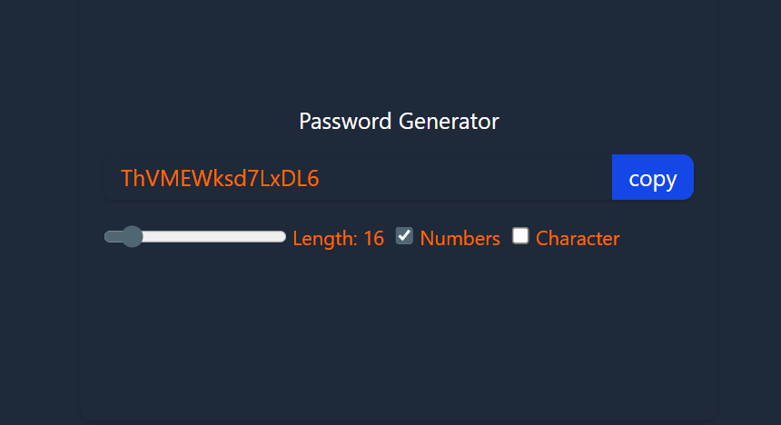

# React Password Generator

A simple and customizable password generator built with React.  
Generate secure passwords by selecting length, including numbers, and special characters. Easily copy the generated password to your clipboard.

---

## Features

- Adjustable password length (6 to 100 characters)
- Option to include numbers
- Option to include special characters
- Copy generated password with one click
- Auto-generates password on option changes

---

## Demo

  

---

## Installation

1. Clone the repository:

    git clone https://github.com/yourusername/react-password-generator.git

2. Navigate into the project directory:

    cd react-password-generator

3. Install dependencies:

    npm install

4. Run the development server:

    npm run dev

5. Open your browser at `http://localhost:3000` (or the port shown in the terminal).

---

## Usage

- Use the slider to set the desired password length.
- Toggle the checkboxes to include numbers and/or special characters.
- Click the "copy" button to copy the generated password to your clipboard.

---

## Code Overview

- The password is generated using a customizable character set.
- Password regenerates automatically when options change.
- Uses React hooks: `useState`, `useEffect`, `useCallback`, and `useRef`.

---

## Dependencies

- React
- Vite (for development server & build)
- Tailwind CSS (for styling, optional if you customize CSS)

---

## License

This project is licensed under the MIT License. See the [LICENSE](LICENSE) file for details.

---

## Author

---
